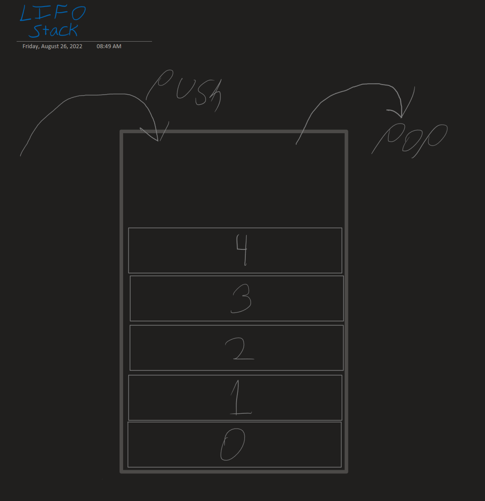

# Class 10
This class goes over the JavaScript Call Stack and provides information about types of errors.

## [Understanding the JavaScript Call Stack](https://medium.freecodecamp.org/understanding-the-javascript-call-stack-861e41ae61d4)

1. What is a 'call'?  
A call is when the engine decides to run, or invoke, a function. When its "turn" on the Call Stack comes up, the engine _calls_ the function.
2. How many ‘calls’ can happen at once?  
As a language with a single-threaded call stack, only one function can be called at a time. This is why it's easy to "block" the stack if you are not careful when handling complex actions.
3. What does LIFO mean?  
Last-In First-Out. It's how the call stack works. It's also like a stack of cards. Something goes on top of the stack, and to then retrieve something you must pull from the top. It is the opposite of how a queue works.
4. Draw an example of a call stack and the functions that would need to be invoked to generate that call stack.  

5. What causes a Stack Overflow?  
A Stack Overflow occurs when a recursive function executes without an exit point. At some point, it will reach the browser's maximum call size and cause a Stack Overflow.

## [JavaScript Error Messages](https://codeburst.io/javascript-error-messages-debugging-d23f84f0ae7c)

1. What is a ‘reference error’?  
A reference error occurs when the code tries to use a variable that has not been declared.
2. What is a ‘syntax error’?  
Syntax errors happen when the code cannot be parsed or interpreted. This can happen when a closing bracket is missing, for example.
3. What is a ‘range error’?
Range errors happen when a given value is not in the range of allowed values, such as when attempted to set a negative length on an array object.
4. What is a ‘type error’?
Type errors occurt when code attempts an operation that cannot be performed, usually because a value is not of the expected type. An example is when trying to set a `const` variable to a new value.
5. What is a breakpoint?
A breakpoint essentially pauses code. There are different types of breakpoints, such as those that stop code at a particular line, or those that stop code in response to a particular event.
6. What does the word ‘debugger’ do in your code?
The `debugger` statement tells any existing debugging functionality (such as in the browser) to set a breakpoint. If no debugging functionality exists in the current environment, this statement does nothing.
